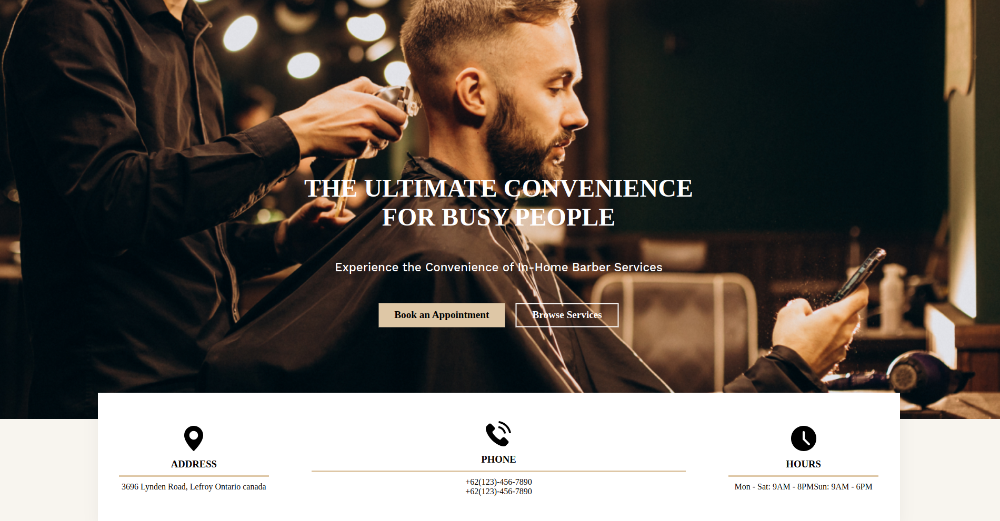
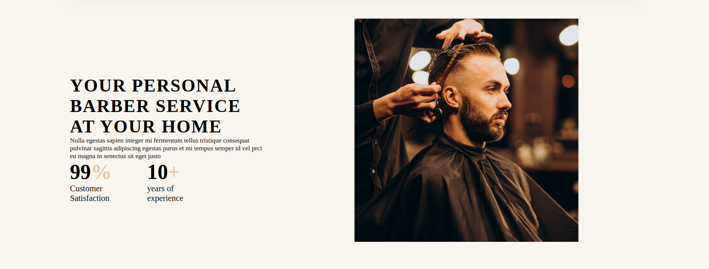
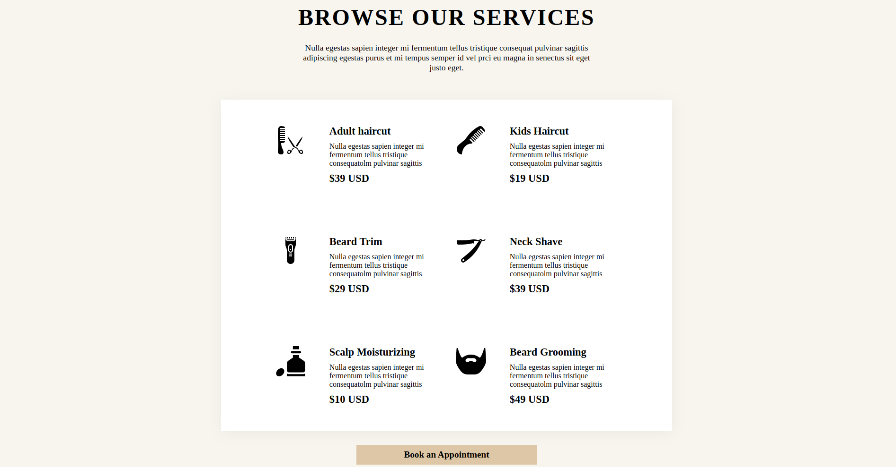
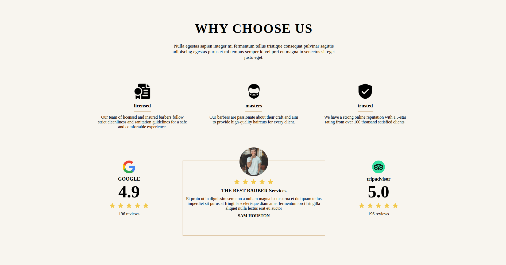
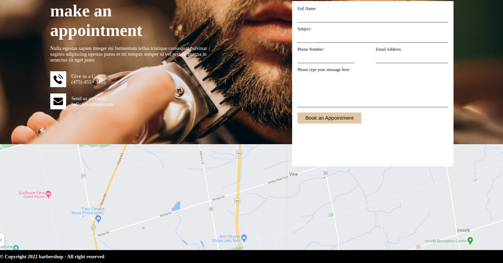

# hb_cutzz - Barber Shop Website


## Description

hb_cutzz is a modern and convenient barber shop website designed for users to book appointments for in-home barber services. The website is built using HTML, CSS, Node.js, Express, and SQLite for database storage. The user interface design was created by [Figma Designer](https://www.figma.com/file/D8hCzOdAx2FeL8rb0S0Vrn/Barbershop-(Community)?type=design&node-id=0-1&mode=design&t=c8RUuRUBNwFMtyjD-0) (insert Figma URL here).

## Screenshots








## Features

- **Convenient Booking:** Users can easily book appointments for in-home barber services.
- **Service Information:** Browse services with detailed descriptions and pricing.
- **Customer Reviews:** Showcase reviews and ratings from satisfied clients.
- **Contact Form:** A form for users to inquire about services or provide feedback.

## Installation

1. Clone the repository:

```bash
git clone https://github.com/your-username/hb_cutzz.git
```


2. Install dependencies:

npm install

3. Run the application:

npm start
 
Visit http://localhost:3000 in your browser.

## Usage

- Open the website in your browser.
- Explore the services offered and browse customer reviews.
- Book an appointment using the provided form.
- Contact the barbershop for additional inquiries.

## Technologies Used

- HTML
- CSS
- Node.js
- Express
- SQLite

## Acknowledgments

UI design by Figma Designer.
Special thanks to [Name] for inspiration or collaboration (if applicable).

# License

MIT License

